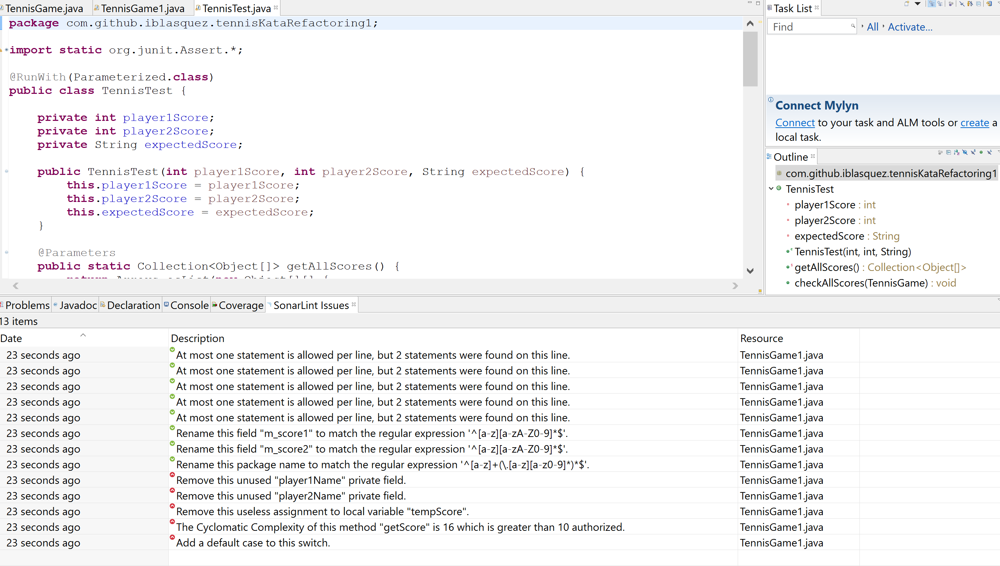

# Prêt(e) pour ... l'analyse SonarLint d'un projet sous Eclipse ?

Qualité de code, dette technique, inspection continue...

Notre mission du jour est la suivante :  
 
**En tant** qu'apprenti(e) Crafts(wo)man  
**Nous voulons** prendre en main [SonarLint](http://www.sonarlint.org/) sous Eclipse  
**Afin de** disposer d'indicateurs de qualité pour nous aider à améliorer dès demain le code de nos projets

Pour réaliser, cette mission, rien de mieux qu'un projet simple doté de quelques petits problèmes de [dette technique](https://fr.wikipedia.org/wiki/Dette_technique) : le premier **kata Tennis refactoring** disponible sur le github d'[Emily Bache](https://twitter.com/emilybache) à l'adresse suivante :[https://github.com/emilybache/Tennis-Refactoring-Kata](https://github.com/emilybache/Tennis-Refactoring-Kata) sera idéal. Cette mission est bien sûr accessible à tous puisqu'elle sera réalisée en pas à pas...

**Alors Prêt(e) pour l'analyse [SonarLint](http://www.sonarlint.org/) sous Eclipse ?**

J'imagine que oui, puisque vous continuez à lire ces quelques lignes ...
Alors, c'est parti, relevons ensemble LA mission du jour !

## Préparation du projet à analyser

Commençons par créer notre **projet maven sous Eclipse** que nous appelerons`tennisKataRefactoring1`par exemple.  

Décidons, arbitrairement, de ne garder que **les fichiers relatifs au premier kata de refactoring**, c'est-à-dire les fichiers sources `TennisGame.java` et `TennisGame1.java` ainsi que le fichier test `TennisTest.java` disponibles sur [https://github.com/emilybache/Tennis-Refactoring-Kata](https://github.com/emilybache/Tennis-Refactoring-Kata)  
Remarques : Si vous gardez les autres fichiers, le reste du tutoriel marchera tout aussi bien, mais avec des résultats différents ;-) et hop, un petit rappel au passage sur comment [cloner un dépôt](https://help.github.com/articles/cloning-a-repository/).

Une fois le projet créé, vérifions qu'il compile bien et lançons les tests afin de vérifier que tous les tests passent bien au vert et que nous pourrions ainsi, si l'occasion s'en présentait, travailler en toute confiance sur ce projet...

Le *[refactoring](http://martinfowler.com/books/refactoring.html)* de ce code fera l'objet d'une autre mission, nous nous intéresserons ici uniquement à l'analyse de code à l'aide de [SonarQube](http://www.sonarqube.org/).

## Installation du plug-in SonarLint

SonarLint est un plug-in proposé par [Sonar Source](http://www.sonarsource.com/) destiné à votre IDE préféré (Eclipse, IntelliJ) et qui va vous donner des indications sur la qualité de votre code :

Sur le site [sonarlint.org](http://www.sonarlint.org/), il est présenté de la manière suivante :

> SonarLint is an extension to your favorite IDE that provides on-the-fly feedback to developers on new bugs and quality issues injected into their code.

Le plus simple pour installer plug-in SonarLint est de passer par l'Eclipse Market :

* soit depuis le site web à l'adresse suivante : [https://marketplace.eclipse.org/content/sonarlint](https://marketplace.eclipse.org/content/sonarlint) où il vous suffira de drag en dropper le bouton `Install` de l'Eclipse Market vers votre IDE pour que le plug-in s'installe.

* soit depuis l'IDE à partir de : `Help -> Eclipse Marketplace...`

Après l'installation du plug-in, un redémarrage d'Eclipse est nécessaire.

*Remarque :* 
Le plug-in SonarLint pour Eclipse est présenté [ici](http://www.sonarlint.org/eclipse/).
Un SonarLint User group est accessible [ici](https://groups.google.com/forum/#!forum/sonarlint).

## Lancement d'une analyse SonarLint sous Eclipse

Il est possible de lancer une analyse de code SonarLint sur un fichier à partir d'un clic droit puis de `SonarLint -> Analyze...`

*Remarque :* L'analyse SonarLint est ensuite automatiquement lancé, du moment que le fichier est ré-ouvert ou sauvegardé.

Lancons une **analyse SonarLint sur votre fichier `TennisGame1.java`**.

## Analyse du code par SonatLint sous Eclipse

L'analyse de code consignent ces résultats appelées **issues** (défauts) dans l'onglet **`SonarLint Issues`** . Elles les classent en issues majeures (annotées en rouge) et issues mineures (annotées en vert).

### Listes des issues dans l'onglet `SonarLint Issue`

L'analyse sur le fichier `TennisGame1.java` pourrait par exemple donner :

Cette analyse nous a fait ressortir 5 issues majeures (en rouge) et 8 issues mineures.

Jetons un rapide coup d'oeil aux issues... Comme issues majeures, nous pouvons relever, entre autres :

- que les attributs privés `player1Name` et `player2Name` ne semblent pas être utilisés, 
- que la méthode `getScore` a une [complexité cyclomatique](https://fr.wikipedia.org/wiki/Nombre_cyclomatique) un peu importante. La complexité cyclomatique permet [de calculer le niveau de complexité de l'algorithme d'une méthode et la difficulté à la tester exhaustivement. La complexité cyclomatique se mesure en comptant le nombre de boucles et de conditions dans le code, c'est-à-dire le nombre d'instruction "if", "while", "do", "for", "switch" et "case".](http://www.journaldunet.com/developpeur/expert/10545/une-qualimetrie-simple-au-service-des-developpeurs.shtml). Effectivement, en regardanr le code, on remarque bien, au premier coup d'oeil, que la méthode `public String getScore()` comporte un peu trop de `if` pour une compréhension rapide et efficace d'une lecture rapide du code... Par défaut, nous pouvons mêm remarquer que Sonar indique qu'il fixe la complexite cyclomatique à 10. Cette règle, comme toute autre règle, pourrait très bien être modifiée, par la suite, sur le serveur en fonction de nos besoins.

### En savoir plus sur une  issue via l'onglet `Sonar Lint Rule Description`

Pour savoir à quelle règle de codage correspond l'issue, il vous suffit de vous placer sur une issue dans l'onglét **`SonarLint Issue`**, par exemple l'issue majeure **`Remove this unused "player1Name" private field.`**, puis à l'aide d'un clic droit de sélectionner **`Rule Description`** afin d'ouvrir un nouvel ongle **`Sonar Lint Rule Description`** qui explique la règle à respecter :

* Remarque : * Une fois cette onglet ouvert, vous pouvez passer de l'onglet `SonarLint Issue` à l'onglet `Sonar Lint Rule Description` pour avoir accèder à la description des règles sans avoir besoin de relancer à chaque fois `Rule Description`.

### De l'issue au code ....
**Cliquer sur une issue** amène **directement dans le fichier Java à la ligne de code concernée par cette issue**, ce qui est très pratique pour corriger l'issue le moment voulu... 
Dans cette mission, nous n'avons pas besoin de modifier le code de ce projet. Si le coeur vous en dit, vous pouvez toutefois essayer de corriger une ou plusieurs issues, puis de relancer l'analyse juste pour voir l'évolution des données d'analyse ...

Notons bien que pour le moment, **une telle analyse SonarQube est uniquement réalisée en local** et que les données de l'analyse ne sont pas encore poussées sur le serveur...

### A suivre...

Pour l'instant, la page du plug-in SonarLint pour Eclipse qui se trouve à l'adresse suivante : [www.sonarlint.org/eclipse/](http://www.sonarlint.org/eclipse/)  nous indique :

**How can I connect SonarLint to my SonarQube server?**  
At the moment, SonarLint works entirely offline (locally), embedding all analyzers and settings needed, and it's not possible to connect it to a SonarQube server. Soon it will be possible to link SonarLint to a SonarQube server instance to use its analyzers, configured rules, etc.

**How to configure rules?**  
You can't for now. We will make this feature available in upcoming versions, probably by requiring to "connect" SonarLint with an existing SonarQube server instance.

***Affaire à suivre ..***

## Conclusion
Au cours de cette mission, nous avons installé le plug-in SonarLint sous Eclipse.  
Il est ainsi possible de lancer une analyse SonarLint `SonarLint-> Analyze`, l'onglet `SonarLint Issues` sera mis à jour (**analyse locale**) et proposera une liste d'issues mineures et majeures qui nous permet d'accéder rapidement au code.

*Remarque:* Une analyse Sonar plus complète peut être lancée et poussée vers un serveur Sonar. Pour cela, il faut utiliser un goal maven, mais c'est une autre histoire qui se passe par [là](Analyse_SonarQubeServer.md)...

## Liens SonarLint en ligne
La présentation du plug-in SonarLint pour Eclipse se trouve à l'adresse suivante : [www.sonarlint.org/eclipse/](http://www.sonarlint.org/eclipse/)    
Un SonarLint User group est accessible [ici](https://groups.google.com/forum/#!forum/sonarlint).

### Continuez le tutoriel par l'[Analyse d'un projet maven/Eclipse sur le serveur SonarQube](Analyse_SonarQubeServer.md)  

