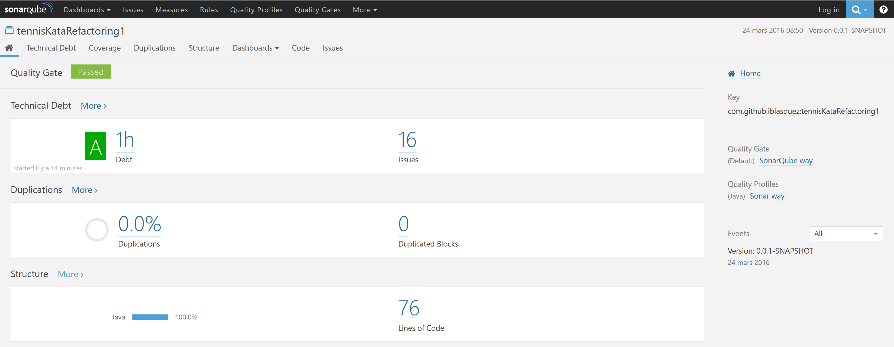
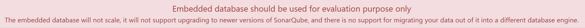

# Analyse d'un projet maven/Eclipse sur le serveur SonarQube

Qualité de code, dette technique, inspection continue...

Notre mission du jour est la suivante :  
 
**En tant** qu'apprenti(e) Crafts(wo)man  
**Nous voulons** prendre en main [SonarQube]([SonarQube](http://www.sonarqube.org/)) sous Eclipse sur un projet maven  
**Afin de** disposer d'indicateurs de qualité pour nous aider à améliorer dès demain le code de nos projets

Pour réaliser, cette mission, rien de mieux qu'un projet simple doté de quelques petits problèmes de [dette technique](https://fr.wikipedia.org/wiki/Dette_technique) : le premier **kata Tennis refactoring** disponible sur le github d'[Emily Bache](https://twitter.com/emilybache) à l'adresse suivante :[https://github.com/emilybache/Tennis-Refactoring-Kata](https://github.com/emilybache/Tennis-Refactoring-Kata) sera idéal.


**Attention : avant de commencer, vérifiez que vous disposez bien de la variable d'environnement `JAVA_HOME`** pointant vers la racine du dossier jdk contenant votre Java Development Kit, sinon jetez un petit coup d'oeil par [là](https://github.com/iblasquez/Back2Basics_Developpement)...


## Préparation du projet maven à analyser
Créer un **projet maven sous Eclipse** (`tennisKataRefactoring1`par exemple) à partir **des fichiers relatifs au premier kata de refactoring**, c'est-à-dire les fichiers sources `TennisGame.java` et `TennisGame1.java` ainsi que le fichier test `TennisTest.java` disponibles sur [https://github.com/emilybache/Tennis-Refactoring-Kata](https://github.com/emilybache/Tennis-Refactoring-Kata)  
Remarques : Si vous venez de faire le tutoriel [Prêt(e) pour ... l'analyse SonarLint d'un projet sous Eclipse ?](PriseEnMain_SonarLintEclipse.md), tout est déjà prêt...

## Installation de SonarQube
Pour installer SonarQube sous Eclipse, commençons par [télécharger SonarQube](http://www.sonarqube.org/downloads/), puis dézippons-le dans un répertoire `Sonar`.  

Démarrons ensuite SonarQube en recherchant le script de démarrage dans le `bin` dans le sous-répertoire correspondant à notre OS (`StartSonar.bat` pour Windows, `Sonar.sh` pour linux).

Vérifions ensuite que Sonar ait bien démarré en accédant à l'interface web de ce dernier dont l'adresse est : [http://localhost:9000](http://localhost:9000) 


## Pousser simplement l'analyse sur le serveur SonarQube via un goal maven

Pour pousser simplement l'analyse SonarQube d'un projet maven sur le serveur SonarQube, nous allons devoir créer un goal maven.

Sous Eclipse, il est possible de créer un **nouveau *goal maven*** de la manière suivante. A partir d'un clic droit sur le projet maven, sélectionnons `Run As -> Run Configurations …` puis `Maven Build`, et enfin un dernier petit clic droit pour un petit `New` dans lequel il ne reste plus qu'à renseigner les 3 paramètres suivants puis cliquer sur `Apply` pour valider :

- **Name** : *Maven Sonar*
- **Base directory** : *${project_loc}*
- **Goals** : *clean install sonar:sonar -Dmaven.test.failure.ignore=true*

Nous pouvons lancer cette tâche pour la première fois en cliquant sur le bouton `Run`.
Désormais, lorsque nous souhaiterons relancer cette analyse SonarQube, il suffira simplement de cliquer sur le `Maven Sonar` accesible depuis un `Run As -> Run Configurations …` 
Le `Maven Sonar` sera également réutilisable sur nos autres projets Maven sans devoir rééditer sa configuration.

Lançons donc le `Maven Sonar`...  
Si tout marche bien du premier coup, on obtient en fin de console un magnifique `BUILD SUCCESS`. 
Sinon, il faut prendre le temps de corriger les erreurs pour passer du `BUILD FAILED` au `BUILD SUCCESS` : [Google](https://www.google.fr) et [Stack Overflow](http://stackoverflow.com/) deviennent alors nos deux meilleurs amis ;-)

Pour ma part, j'ai rencontré une erreur du type : `Fatal error compiling: tools.jar not found: C:\Program Files\Java\jre1.8.0_45\..\lib\tools.jar` que j'ai résolue grâce à [How to force Eclipse m2e plugin to use jdk for a project](http://stackoverflow.com/questions/25592290/how-to-force-eclipse-m2e-plugin-to-use-jdk-for-a-project). Sous Windows, il peut aussi y avoir des problèmes de variables d'environnement `JAVA_HOME`, jetez un petit coup d'oeil sur le post suivant peut aider [Fatal error compiling: tools.jar not found - maven-compiler-plugin](http://stackoverflow.com/questions/29234759/fatal-error-compiling-tools-jar-not-found-maven-compiler-plugin).

Yes! Notre build est enfin `BUILD SUCCESS` !!!

## Visualiser l'analyse sur le serveur SonarQube

Rendez-vous sur votre serveur Sonar Qube : [http://localhost:9000](http://localhost:9000) et sélectionnons notre projet  `tennisKataRefactoring1` qui apparaît désormais dans la liste des **PROJECTS**.

### Une vision générale du projet  (dashboard)
Nous obtenons alors **un tableau de bord** interactif (plus communement **dashboard**) qui affiche des indicateurs sur la **dette technique**, la **duplication de code** et la **structure du projet.** 




*Remarque :*   
Le but d'une analyse SonarQube est de vous donner des indications sur les *7 péchés capitaux du développeur* qui ne sont autre qu'une mauvaise distribution de la complexité, qu'une duplication de code, qu'un mauvais design, que l'existence de bugs potentiels, qu'une mauvaise couverture par les tests  unitaires, qu'un non-respect des standards de programmation et qu'une présence de pas ou de trop de commentaires.    

Si vous voulez en savoir plus sur ces *7 péchés capitaux du développeurs*, jetez  petit coup d'oeil  :  

* sur la rubrique Developers' Seven Deadly Sins de la documentation SonarQube accessible [ici](http://docs.sonarqube.org/display/HOME/Developers'+Seven+Deadly+Sins)  
* et/ou sur ces deux présentations : [SONAR : Inspection continue : La chasse aux sept péchés capitaux peut commencer!](http://fr.slideshare.net/ElsassJUG/soire-qualit-logicielle-avec-sonar) ou 
[SONAR : La chasse aux 7 péchés du développeur](http://blog.netapsys.fr/sonar-la-chasse-aux-7-peches-du-developpeur-2/)


### Des indicateurs plus détaillés ...

Prenons maintenant le temps de nous familiariser avec ce tableau de bord : observons les données affichées et en découvrons clic après clic les différentes indicateurs (autres vues : **Duplications** et **Structure**) proposées par SonarSource pour chacune des trois vues :  **Technical Debt**, **Duplications** et **Structure**

Prenez maintenant le temps de nous familiariser avec ce tableau de bord : observons les données affichées et en découvrez clic après clic via **`More`** les différentes indicateurs proposés par SonarSource pour chacune des trois vues : **Technical Debt**, **Duplications** et **Structure**.

Le [User Guide](http://docs.sonarqube.org/display/SONAR/User+Guide) permet d'en savoir plus sur les vues et les différents indicateurs:

* pour **la dette technique** rendez-vous à la rubrique [**Technical Debt du User Guide**](http://docs.sonarqube.org/display/SONAR/Technical+Debt). Vous noterez que vous retrouvez dans le détail de cette vue, la liste des issues mineures et majeures fournies précédemment par [SonarLint](Analyse_SonarLintEclipse.md).   
* pour **la duplication** rendez-vous à la rubrique [**Component duplications du User Guide**](http://docs.sonarqube.org/display/SONAR/Component+duplications) ainsi qu'à la rubrique [**Duplications du Developers' Seven Deadly Sins**](http://docs.sonarqube.org/display/HOME/Duplications).
* pour **la structure** rendez-vous par exemple aux rubriques suivantes [**Bad Distribution of Complexity**](http://docs.sonarqube.org/display/HOME/Bad+Distribution+of+Complexity), [**Not Enough or Too Many Comments**](http://docs.sonarqube.org/display/HOME/Not+Enough+or+Too+Many+Comments).

*Remarque :*  
En parallèle de cette exploration, il peut être pratique, même s'il s'agit de l'ancienne interface proposée par SonarQube, de jeter un petit coup d'oeil sur la partie [Visualisation des données de l'article *Contrôler la qualité de ses projets avec Sonar*](http://linsolas.developpez.com/articles/java/qualite/sonar/?page=page_5) pour disposer d'explications sur les différent(e)s indicateurs/vues proposé(e)s.


### Des règles pour analyser

L'onglet **`Rules`** vous permet de gérer les règles utilisées lors de l'analyse du code de votre projet.    
Cliquons sur cet onglet pour afficher la liste des règles.  
La rubrique [**Rules**](http://docs.sonarqube.org/display/SONAR/Rules) de la documentation SonarQube vous en dira un peu plus sur ces règles...


## Visualiser la couverture sur le serveur SonarQube

Pour poouvoir récupérer le pourcentage de couverture sur votre **dashboard**, il va falloir complèter le **`pom.xml`** du projet à analyser.

Tout d'abord, le bloc **`properties`** devra contenir 3 propriétés suivantes :

```XML  

	<properties>
		//... Proprerties déjà existantes
		<sonar.core.codeCoveragePlugin>jacoco</sonar.core.codeCoveragePlugin>
  		<sonar.jacoco.reportPath>${project.basedir}/../target/jacoco.exec</sonar.jacoco.reportPath>
  		<sonar.language>java</sonar.language>
	</properties>

```

bien sûr, il faut s'assurer qu'une dépendance à JUnit est bien présente dans le bloc **`dependencies`** :

```XML  

	<dependency>
		<groupId>junit</groupId>
		<artifactId>junit</artifactId>
		<version>4.12</version>
		<scope>test</scope>
	</dependency>

```

Il ne reste plus qu'à configurer le plug-in de la manière suivante dans un bloc **`build`** :

```XML  

	<build>
  		<plugins>
    		<plugin>
      			<groupId>org.apache.maven.plugins</groupId>
      			<artifactId>maven-surefire-plugin</artifactId>
      			<version>2.18.1</version>
    		</plugin>
    		<plugin>
      			<groupId>org.jacoco</groupId>
      			<artifactId>jacoco-maven-plugin</artifactId>
      			<version>0.7.2.201409121644</version>
      			<configuration>
        			<append>true</append>
      			</configuration>
      			<executions>
        			<execution>
          				<goals>
            				<goal>prepare-agent</goal>
          				</goals>
       	 			</execution>
        			<execution>
          				<id>post-unit-test</id>
          				<phase>test</phase>
          				<goals>
            				<goal>report</goal>
          				</goals>
        			</execution>
      			</executions>
    		</plugin>
  		</plugins>
	</build>

```

Mettre à jour, votre `pom.xml`.  
Faites un **`mvn clean test`** sous Eclipse, clic droit depuis votre projet puis **`Run as -> Maven clean`**  
 
Relancer votre analyse sonar (`Run As -> Run Configurations … -> Maven Sonar`) et consulter votre nouveau dashboard.

**Astuce :** Pour accèder rapidement à votre dashboard, jetez un petit coup d'oeil sur les logs de la console.  
Lorsque le build s'est bien passé, vous avez entre autre une ligne indiquant **`ANALYSIS SUCCESSFUL`**.  
La fin de cette ligne donne une url du genre :
**`http://localhost:9000/dashboard/index/groupIdDeVotreProjet:artifactIdDeVotreProjet`**.
Copiez la, et collez la directement dans la barre de votre navigateur, vous devriez vous retrouvez directement sur votre **dashboard** :smile:


En savoir plus [Enabling code coverage : in Sonar, from Jenkins, with Maven, using Jacoco](https://www.unicoda.com/?p=1798)...


## Et pour finir ...
**Attention**, nous avons poussé le plus simplement possible l'analyse vers le serveur Sonar Qube, juste pour une découverte de l'outil.  

Pour une configuration plus complète d'une analyse SonarQube sur une projet Maven, veuillez consulter la documentation **Analyzing with SonarQube Scanner for Maven disponible** [ici](http://docs.sonarqube.org/display/SCAN/Analyzing+with+SonarQube+Scanner+for+Maven) 

Notez également que pour cette prise en main de SonarQube, nous avons utilisé la base embarquée par défaut.   
Sur un projet réel, il faudra [configurer Maven afin d'utiliser une *vraie base de données*](http://docs.sonarqube.org/display/SONAR/Installing+the+Server), comme nous le rappelle l'interface web du serveur :


Vous trouverez la documentation relative à ce point dans la rubrique **Installing the Server** de la [documentation de SonarQube](http://docs.sonarqube.org/display/SONAR/Documentation) directement accessible depuis[ici](http://docs.sonarqube.org/display/SONAR/Installing+the+Server).


Il est à noter qu'un projet est automatiquement ajouté sur le serveur SonarQube lorsque sa première analyse est lancée. Toutefois, la rubrique [Project Administration de la documentation SonarQube](http://docs.sonarqube.org/display/SONAR/Project+Administration), vous donne toutes les indications nécessaires pour ajouter un nouveau projet sur votre serveur SonarQube, si nécessaire.


