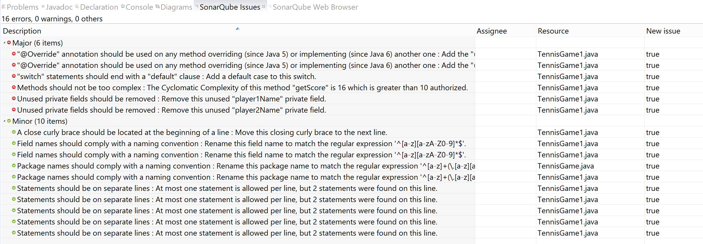
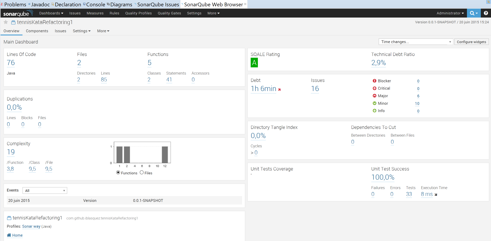
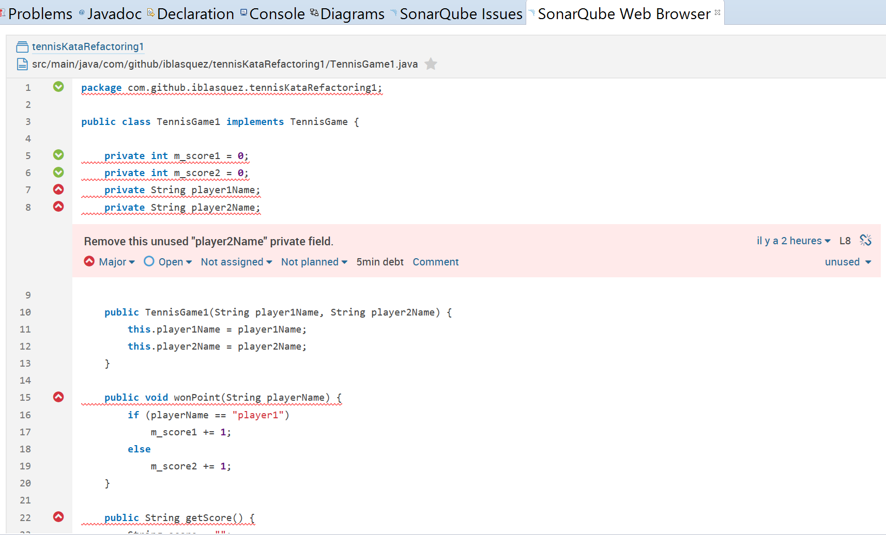
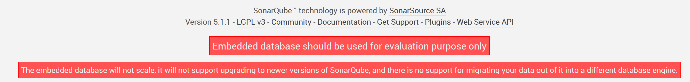

# Prêt(e) pour ... l'analyse SonarQube d'un projet maven sous Eclipse ?

Qualité de code, dette technique, inspection continue...

Notre mission du jour est la suivante :  
 
**En tant** qu'apprenti(e) Crafts(wo)man  
**Nous voulons** prendre en main [SonarQube]([SonarQube](http://www.sonarqube.org/)) sous Eclipse sur un projet maven  
**Afin de** disposer d'indicateurs de qualité pour nous aider à améliorer dès demain le code de nos projets

Pour réaliser, cette mission, rien de mieux qu'un projet simple doté de quelques petits problèmes de [dette technique](https://fr.wikipedia.org/wiki/Dette_technique) : le premier **kata Tennis refactoring** disponible sur le github d'[Emily Bache](https://twitter.com/emilybache) à l'adresse suivante :[https://github.com/emilybache/Tennis-Refactoring-Kata](https://github.com/emilybache/Tennis-Refactoring-Kata) sera idéal. Cette mission est bien sûr accessible à tous puisqu'elle sera réalisée en pas à pas...

**Alors Prêt(e) pour l'analyse [SonarQube](http://www.sonarqube.org/) d'un projet maven sous Eclipse ?**

J'imagine que oui, puisque vous continuez à lire ces quelques lignes ...
Alors, c'est parti, relevons ensemble LA mission du jour !

## Préparation du projet maven à analyser
Commençons par créer notre **projet maven sous Eclipse** que nous appelerons`tennisKataRefactoring1`par exemple.  

Décidons, arbitrairement, de ne garder que **les fichiers relatifs au premier kata de refactoring**, c'est-à-dire les fichiers sources `TennisGame.java` et `TennisGame1.java` ainsi que le fichier test `TennisTest.java` disponibles sur [https://github.com/emilybache/Tennis-Refactoring-Kata](https://github.com/emilybache/Tennis-Refactoring-Kata)  
Remarques : Si vous gardez les autres fichiers, le reste du tutoriel marchera tout aussi bien, mais avec des résultats différents ;-) et hop, un petit rappel au passage sur comment [cloner un dépôt](https://help.github.com/articles/cloning-a-repository/).

Une fois le projet créé, vérifions qu'il compile bien et lançons les tests afin de vérifier que tous les tests passent bien au vert et que nous pourrions ainsi, si l'occasion s'en présentait, travailler en toute confiance sur ce projet...

Le *[refactoring](http://martinfowler.com/books/refactoring.html)* de ce code fera l'objet d'une autre mission, nous nous intéresserons ici uniquement à l'analyse de code à l'aide de [SonarQube](http://www.sonarqube.org/).

## Installation de SonarQube
Pour installer SonarQube sous Eclipse, commençons par [télécharger SonarQube](http://www.sonarqube.org/downloads/), puis dézippons-le dans un répertoire `Sonar`.  

Démarrons ensuite SonarQube en recherchant le script de démarrage dans le `bin` dans le sous-répertoire correspondant à notre OS (`StartSonar.bat` pour Windows, `Sonar.sh` pour linux).

Vérifions ensuite que Sonar ait bien démarré en accédant à l'interface web de ce dernier dont l'adresse est : [http://localhost:9000](http://localhost:9000) 

## Intégration de SonarQube sous Eclipse
Pour pouvoir utiliser SonarQube sous Eclipse, suivons les trois étapes proposées dans la [documentation de SonarQube](http://docs.sonarqube.org/display/SONAR/SonarQube+in+Eclipse) : installation, configuration et analyse. Il est à noter qu'une documentation similaire est également [disponible pour IntelliJ](http://docs.sonarqube.org/display/SONAR/SonarQube+in+IntelliJ), si tel est votre IDE préféré...

### [Installation du plug-in SonarQube sous Eclipse](http://docs.sonarqube.org/display/SONAR/Installing+SonarQube+in+Eclipse)
Le plus simple pour installer plug-in SonarQube est de passer par l'Eclipse Market (`Help -> Eclipse Marketplace...`), en prenant soin de décocher ce qui est relatif à C++ et à Python. Après l'installation du plug-in, un redémarrage d'Eclipse est nécessaire.

### [Configuration de Sonar Qube sous Eclipse](http://docs.sonarqube.org/display/SONAR/Configuring+SonarQube+in+Eclipse)

**Pour configurer SonarQube sous Eclipse**, il faut tout d'abord s'assurer que le plug-in pointe bien vers notre serveur SonarQube local pour pouvoir y récupérer les règles d'analyse à appliquer sur le code. 

Sous Eclipse, ouvrons le wizard Preferences (`Window -> Preferences`) dans lequel nous sélectionnerons le sous répertoire Servers de SonarQube (`SonarQube -> Servers`). Nous constatons que nous retrouvons l'adresse **http://localhost:9000** : Eclipse configure donc, par défaut, le serveur SonarQube initial.

Via cette interface, il pourra bien sûr être tout à fait possible, par la suite, d'ajouter d'autres serveurs. Nous nous contenterons pour cette mission du serveur par défaut.

**Pour associer notre projet maven à SonarQube**, une fois l'étape précédente réalisée, il nous suffit de mettre à jour le projet maven (clic droit suivi de `Maven > Update Project …`).   
*Remarque:* Il est intéressant de remarquer que SonarQube est automatiquement associé aux projets maven. Si un jour, vous souhaitez par contre faire une analyse SonarQube d'un projet qui n'est pas un projet maven, vous devrez vous rendre dans la [partie Linking a Project to One Analyzed on a SonarQube Server de la documentation de SonarQube](http://docs.sonarqube.org/display/SONAR/Configuring+SonarQube+in+Eclipse) pour en savoir plus.

Une fois la mise à jour effectuée, il ne reste plus qu'à vérifier par un clic droit que le projet maven dispose bien désormais d'un menu `SonarQube`. Ce menu `SonarQube` propose entre autres un sous-menu `Analyze` qui sera utilisé dans l'étape suivante.

### [Analyse du code par SonarCube sous Eclipse](http://docs.sonarqube.org/display/SONAR/Working+with+SonarQube+in+Eclipse)

L'analyse de code à l'aide de SonarQube pourra être visualisée, sous Eclipse, au travers de deux onglets `SonarQube Issues` et `SonarQube Web Browser`.

#### Listes des *issues* et Onglet `SonarQube Issues` (local)

Pour procéder à l'analyse du projet maven en local, commençons par sélectionner à l'aide d'un clic droit sur le projet, le menu `SonarQube-> Analyze`. Un raccourci clavier est également disponible pour lancer plus rapidement cette analyse, il s'agit de `Ctrl+Alt+Q`.

Et bing, l'erreur suivante s'affiche :
`Unknown version for SonarQube server (http://localhost:9000). Please check server is reachable.`

Corrigeons cette erreur en revenant sur `Window -> Preferences-> SonarQube-> Servers` pour editer le serveur par defaut **http://localhost:9000** et le paramétrer avec *admin* comme **userName** et *admin* comme **Password**.
Au passage, un petit clic sur **Test Connection** pour obtenir un petit ***Successfully connected!***

Relançons l'analyse (`SonarQube-> Analyze` ou `Ctrl+Alt+Q`).  
Cette fois-ci, l'analyse se lance bien dans la console et nous pouvons consulter les éventuelles **issues** (défauts) dans l'onglet `SonarQube Issues`en veillant bien à cliquer au préalable sur le nom du projet dans le Package Explorer.

Cette analyse nous a fait ressortir 6 issues majeures et 10 issues mineures.

Jeton un rapide coup d'oeil aux issues... Comme issues majeures, nous pouvons relever, entre autres :

- que les attributs privés `player1Name` et `player2Name` ne semblent pas être utilisés, 
- que la méthode `getScore` a une [complexité cyclomatique](https://fr.wikipedia.org/wiki/Nombre_cyclomatique) un peu importante. La complexité cyclomatique permet [de calculer le niveau de complexité de l'algorithme d'une méthode et la difficulté à la tester exhaustivement. La complexité cyclomatique se mesure en comptant le nombre de boucles et de conditions dans le code, c'est-à-dire le nombre d'instruction "if", "while", "do", "for", "switch" et "case".](http://www.journaldunet.com/developpeur/expert/10545/une-qualimetrie-simple-au-service-des-developpeurs.shtml). Effectivement, en regardanr le code, on remarque bien, au premier coup d'oeil, que la méthode `public String getScore()` comporte un peu trop de `if` pour une compréhension rapide et efficace d'une lecture rapide du code... Par défaut, nous pouvons mêm remarquer que Sonar indique qu'il fixe la complexite cyclomatique à 10. Cette règle, comme toute autre règle, pourrait très bien être modifiée, par la suite, sur le serveur en fonction de nos besoins.

En essayant de **cliquer sur une issue**, nous constatons que cela nous amène **directement dans le fichier Java à la ligne de code concernée par cette issue**, ce qui sera très pratique pour corriger l'issue le moment voulu... 
Dans cette mission, nous n'avons pas besoin de modifier le code de ce projet. Si le coeur vous en dit, vous pouvez toutefois essayer de corriger une ou plusieurs issues, puis de relancer l'analyse juste pour voir l'évolution des données d'analyse ...

Notons bien que pour le moment, **une telle analyse SonarQube est uniquement réalisée en local** et que les données de l'analyse ne sont pas encore poussées sur le serveur...

#### Dashboard et Onglet `SonarQube Web Browser` (analyse poussée et donc disponible également sur le serveur SonarQube)

Pour obtenir **un tableau de bord** plus complet et plus convivial (appelé plus communement **dashboard**), nous allons devoir pousser [l'analyse du projet maven sur le serveur SonarQube](http://docs.sonarqube.org/display/SONAR/Analyzing+with+Maven). 

Sous Eclipse, cela revient à créer un **nouveau *goal maven*** de la manière suivante. A partir d'un clic droit sur le projet maven, sélectionnons `Run As -> Run Configurations …` puis `Maven Build`, et enfin un dernier petit clic droit pour un petit `New` dans lequel il ne reste plus qu'à renseigner les 3 paramètres suivants :

- **Name** : *Maven Sonar*
- **Base directory** : *${project_loc}*
- **Goals** : *clean install sonar:sonar -Dmaven.test.failure.ignore=true*

Nous pouvons alors lancer cette tâche pour la première fois en cliquant sur le bouton `Run`.
Désormais, lorsque nous souhaiterons relancer cette analyse SonarQube, il suffira simplement de cliquer sur le `Maven Sonar` accesible depuis un `Run As -> Run Configurations …` 
Le `Maven Sonar` sera également réutilisable sur nos autres projets Maven sans devoir rééditer sa configuration.

Lançons donc le `Maven Sonar`...  
Si tout marche bien du premier coup, on obtient en fin de console un magnifique `BUILD SUCCESS`. 
Sinon, il faut prendre le temps de corriger les erreurs pour passer du `BUILD FAILED` au `BUILD SUCCESS` : [Google](https://www.google.fr) et [Stack Overflow](http://stackoverflow.com/) deviennent alors nos deux meilleurs amis ;-)

Pour ma part, j'ai rencontré une erreur du type : `Fatal error compiling: tools.jar not found: C:\Program Files\Java\jre1.8.0_45\..\lib\tools.jar` que j'ai résolue grâce à [How to force Eclipse m2e plugin to use jdk for a project](http://stackoverflow.com/questions/25592290/how-to-force-eclipse-m2e-plugin-to-use-jdk-for-a-project). Sous Windows, il peut aussi y avoir des problèmes de variables d'environnement `JAVA_HOME`, jetez un petit coup d'oeil sur le post suivant peut aider [Fatal error compiling: tools.jar not found - maven-compiler-plugin](http://stackoverflow.com/questions/29234759/fatal-error-compiling-tools-jar-not-found-maven-compiler-plugin).

Yes! Notre build est enfin `BUILD SUCCESS` !!!

En cliquant, dans le package Explorer d'Eclipse, **sur la racine du projet**, il apparaît alors dans l'onglet `SonarQube Web Browser`, un **dashboard interactif contenant les données d'analyse du projet**.  

Ce **dashboard** affiche des indicateurs pour chacun des *7 péchés capitaux du développeur* qui ne sont autre qu'une mauvaise distribution de la complexité, qu'une duplication de code, qu'un mauvais design, que l'existence de bugs potentiels, qu'une mauvaise couverture par les tests  unitaires, qu'un non-respect des standards de programmation et qu'une présence de pas ou de trop de commentaires.

Remarque : Si vous voulez en savoir plus sur les *7 péchés capitaux du développeurs*, jetez  petit coup d'oeil sur [SONAR : Inspection continue : La chasse aux sept péchés capitaux peut commencer!](http://fr.slideshare.net/ElsassJUG/soire-qualit-logicielle-avec-sonar) ou 
[SONAR : La chasse aux 7 péchés du développeur](http://blog.netapsys.fr/sonar-la-chasse-aux-7-peches-du-developpeur-2/)

Prenons maintenant le temps de nous familiariser avec ce tableau de bord : observons les données affichées et en découvrons clic après clic les différentes indicateurs (autres vues) proposés par SonarSource.
En parallèle de cette exploration, il est pratique de jeter un petit coup d'oeil sur la partie [Visualisation des données de l'article *Contrôler la qualité de ses projets avec Sonar*](http://linsolas.developpez.com/articles/java/qualite/sonar/?page=page_5) pour disposer d'explications sur les fifférent(e)s indicateurs/vues proposé(e)s. 

 
En cliquant maintenant dans le package Explorer d'Eclipse **sur un fichier java quelconque du projet**, nous observons qu'apparaît alors dans l'onglet `SonarQube Web Browser` **le code de ce fichier accompagné d'icônes vertes et rouges** pour indiquer respectivement les issues mineures et majeures. En cliquant sur une icône, on obtient des informations supplémentaires sur l'issue qu'elle représente.

Rappelons enfin qu'en utilisant, le *goal `Maven Sonar`*, les données sont poussées sur le serveur SonarQube. **Ce dashboard est donc désormais également disponible sur notre serveur SonarQube** (**[http://localhost:9000](http://localhost:9000)**). 
Vous apprécierez surement de pouvoir consulter le dashboard depuis le serveur plutôt que depuis l'onglet  `SonarQube Web Browser` sous Eclipse...En tous cas, les deux sont désormais possible.

## Conclusion
Au cours de cette mission, nous avons installé et paramétré SonarQube pour pouvoir l'utiliser sous Eclipse sur un projet maven. Désormais,

- si on lance une analyse SonarQube à partir de `SonarQube-> Analyze`, l'onglet `SonarQube Issues` sera mis à jour (analyse locale) et proposera une liste d'issues mineures et majeures qui nous permet d'accéder rapidement au code.

- si on lance une analyse SonarQube à partir de `Run As -> Run Configurations … -> Maven Sonar`, l'onglet `SonarQube Web Browser` sera mis à jour et proposera un tableau de bord (dashboard) qui nous est maintenant familier et les données seront également poussées sur le serveur SonarQube (**[http://localhost:9000](http://localhost:9000)** par défaut)

**Mission Done !**

Pour finir, il faut toutefois noter que pour tester rapidement SonarQube, nous avons utilisé la base embarquée par défaut. Sur un projet réel, il faudra [configurer Maven afin d'utiliser une *vraie base de données*](http://docs.sonarqube.org/display/SONAR/Installing+and+Configuring+Maven), comme nous le rappelle l'interface web du serveur :

## Liens

[Documentation de SonarQube](http://docs.sonarqube.org/display/SONAR/Documentation)  

[SONAR : La chasse aux 7 péchés du développeur](http://blog.netapsys.fr/sonar-la-chasse-aux-7-peches-du-developpeur-2/) 

[SONAR : Inspection continue : La chasse aux sept péchés capitaux peut commencer !](http://fr.slideshare.net/ElsassJUG/soire-qualit-logicielle-avec-sonar) 

[Contrôler la qualité de ses projets avec Sonar : Visualisation des données](http://linsolas.developpez.com/articles/java/qualite/sonar/?page=page_5) 

[Mesurer la qualité du code Java avec SonarQube, Eclipse et Maven](http://cedric.joyau.free.fr/?p=198)

[Sonar Installation and Eclipse Plug-in](http://eclipse.dzone.com/articles/static-code-analysis-and)

[De l'audit de Code à l'Inspection Continue](http://www.devoxx.com/pages/viewpage.action?pageId=6128114)

## Notes
Tout feedback est bien sûr le bienvenu pour améliorer ce document via une petite [pull request](https://help.github.com/articles/creating-a-pull-request/) !

## Bonus
Lorque vous souhaiterez [configurer un projet sur le Serveur SonarQube](http://docs.sonarqube.org/display/SONAR/Project+Administration), il sera nécessaire de passer par une étape dite de [Provisioning](http://docs.sonarqube.org/display/SONAR/Provisioning+Projects) qui consiste à déclarer son projet sous SonarQube. Pour cela, il faut se logguer sur le serveur SonarQube en tant qu'Administrator (user=admin, mdp=admin), puis à partir du menu `Settings`dans ouvrir le menu `System` pour sélectionner `Provisionning`. L'étape suivante consiste à créer un projet en cliquant sur `Create` et à choisir un nom et une clé pour ce projet.
Sous Eclipse, l'association au projet ainsi créé sous SonarQube peut être réalisé à partir d'un clic droit suivi de `Sonar -> Change Project Association...` : le champ à modifier étant alors `SonarQubeProject`.
*Remarque:* Par défaut, il semblerait que la clée créée pour un projet maven soit construite de la manière suivante `<groupId>:<artifactId>` et que le nom du projet corresponde simplement à l'`<artifactId>`.

Pour lancer SonarQube sur un simple projet Java, l'étape de Provisionning est indispensable. Ensuite, à partir d'un clic droit et de `Configure -> Associate with SonarQube` il suffit juste de compléter le champ `SonarQube Project` avec la bonne clé...
Une autre solution consiste à transformer le projet en projet maven à l'aide de `Configure -> Convert to Maven Project`, sans oublier un `Update Project`, une fois le projet mavenisé...

